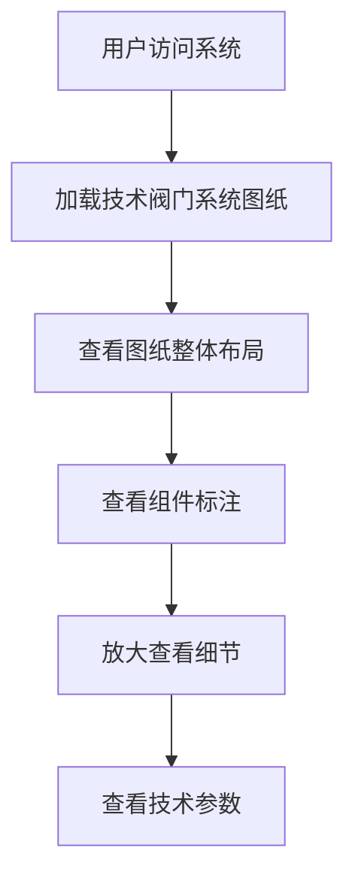

## 1. Product Overview
技术阀门系统图纸渲染工具，用于创建和展示详细的阀门系统技术图纸，支持精准的技术标注和专业的工程图纸风格。
- 主要功能包括技术图纸渲染、组件标注、专业工程风格展示
- 目标用户为工程技术人员、设计工程师和技术文档编制人员

## 2. Core Features

### 2.1 User Roles
| 角色 | 注册方式 | 核心权限 |
|------|---------------------|------------------|
| 普通用户 | 无需注册 | 查看和使用图纸渲染功能 |

### 2.2 Feature Module
1. **图纸渲染页面**：技术阀门系统图纸渲染、组件标注、网格背景
2. **细节展示页面**：放大视图、标注详情、技术参数展示

### 2.3 Page Details
| 页面名称 | 模块名称 | 功能描述 |
|-----------|-------------|---------------------|
| 图纸渲染页面 | 阀门系统渲染 | 渲染完整的技术阀门系统图纸，包括主阀门、控制腔、各种阀体组件 |
| 图纸渲染页面 | 组件标注 | 为各个组件添加绿色标注线和文字说明 |
| 图纸渲染页面 | 网格背景 | 提供专业的工程图纸网格背景 |
| 细节展示页面 | 放大视图 | 支持局部放大查看细节 |
| 细节展示页面 | 标注详情 | 显示各个组件的详细技术参数 |

## 3. Core Process
用户访问系统 → 加载技术阀门系统图纸 → 查看图纸细节和标注 → 可选择放大查看局部细节

## 4. User Interface Design
### 4.1 Design Style
- 主色调：深蓝色背景 (#1a1a2e)、白色线条 (#ffffff)、绿色标注 (#4ade80)
- 按钮风格：简洁线条风格，无圆角
- 字体：等宽字体，技术风格
- 布局风格：专业工程图纸布局，网格背景
- 图标风格：技术工程风格，线条简洁

### 4.2 Page Design Overview
| 页面名称 | 模块名称 | UI元素 |
|-----------|-------------|-------------|
| 图纸渲染页面 | 阀门系统渲染 | 深蓝色网格背景，白色技术线条，绿色标注，专业工程风格 |
| 图纸渲染页面 | 组件标注 | 绿色标注线，白色文字，清晰的组件标识 |
| 图纸渲染页面 | 网格背景 | 精细的网格线条，专业工程图纸风格 |
| 细节展示页面 | 放大视图 | 高清晰度细节展示，支持鼠标悬停放大 |
| 细节展示页面 | 标注详情 | 弹出式技术参数展示，清晰易读 |

### 4.3 Responsiveness
- 桌面优先设计，支持大屏幕显示
- 响应式布局，适配不同屏幕尺寸
- 支持触摸操作，便于在平板设备上查看

### 4.4 3D Scene Guidance
- 环境：专业工程图纸环境，深蓝色背景
- 光照：均匀照明，突出技术线条和标注
- 相机：固定视角，支持局部放大
- 构图：专业工程图纸布局，清晰的组件排列
- 交互：支持鼠标悬停放大，点击查看详情
- 后期处理：线条抗锯齿，标注清晰可见