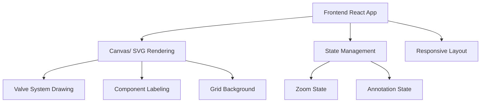

## 1. Architecture Design


## 2. Technology Description
- Frontend: React@18 + TypeScript + Tailwind CSS + Vite
- Initialization Tool: vite-init
- Backend: None (pure frontend application)
- Rendering: SVG for technical drawing
- State Management: React useState and useContext

## 3. Route Definitions
| 路由 | 用途 |
|-------|---------|
| / | 主页面，显示完整的技术阀门系统图纸 |
| /detail | 细节页面，展示放大视图和详细标注 |

## 4. API Definitions
无后端API需求，纯前端渲染应用

## 5. Server Architecture Diagram
无后端架构需求

## 6. Data Model
无数据库需求，所有数据在前端内存中处理

### 6.1 Data Model Definition
- ValveSystem: 包含所有阀门组件和标注信息
- Component: 单个阀门组件，包含位置、尺寸、标注信息
- Annotation: 组件标注，包含文本、位置、连接线信息

### 6.2 Data Definition Language
无数据库需求，使用TypeScript类型定义

```typescript
interface Component {
  id: string;
  type: string;
  position: { x: number; y: number };
  size: { width: number; height: number };
  annotations: Annotation[];
}

interface Annotation {
  id: string;
  text: string;
  position: { x: number; y: number };
  targetComponent: string;
  linePath: { x1: number; y1: number; x2: number; y2: number };
}

interface ValveSystem {
  components: Component[];
  annotations: Annotation[];
  zoomLevel: number;
  viewport: { x: number; y: number; width: number; height: number };
}
```